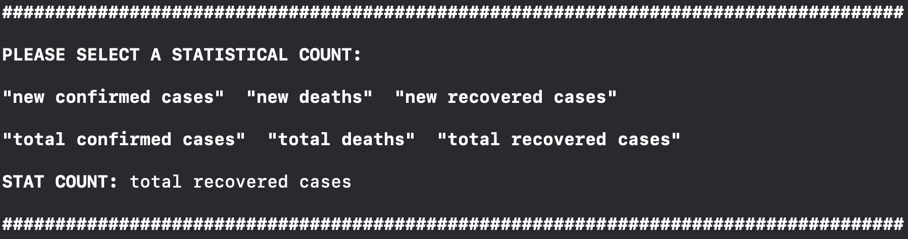

# COVID-19 DATA-MODELLING

## Compiling, Linking, and Running Instructions
----------------------------------------------------------------------------------------
- To operate program, place header and cpp files in correct location (or in the same directory)
- Build and run main.cpp, wait for prompts

## Demonstration

#### Step 1:

#### Step 2:

#### Step 3:

#### Step 4:

#### Step 5:

